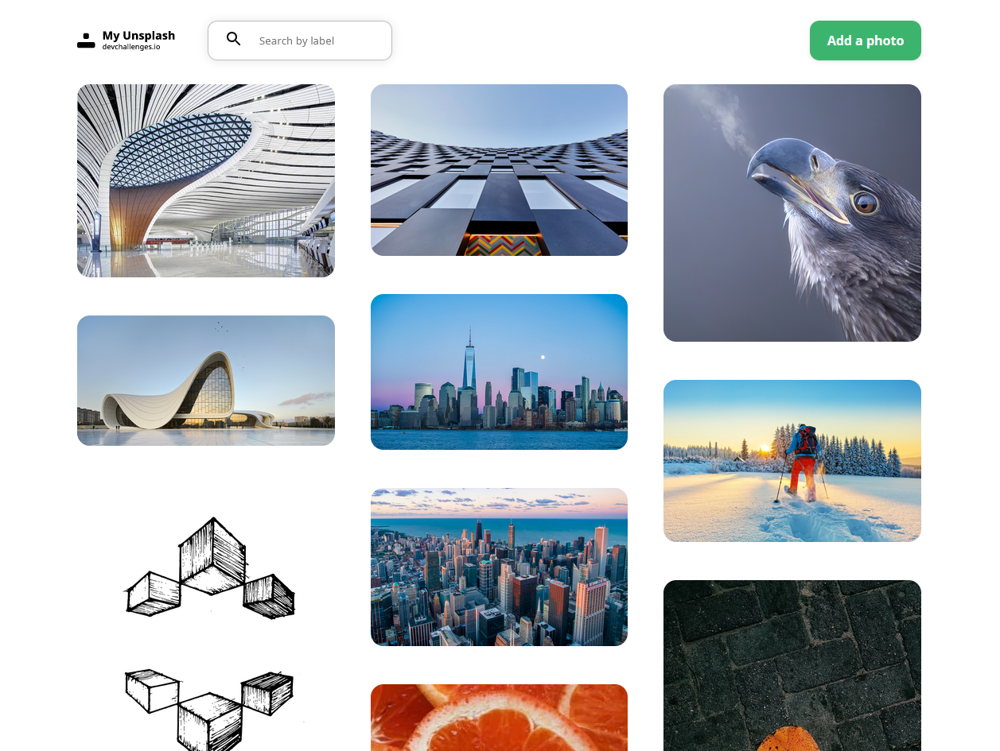

<!-- Please update value in the {}  -->

<h1 align="center">MyUnSplash</h1>

<div align="center">
   Solution for a challenge from  <a href="http://devchallenges.io" target="_blank">Devchallenges.io</a>.
</div>

<div align="center">
  <h3>
    <a href="https://www.figma.com/file/a1xUD6nInLKRz6evFKKdir">
      Demo
    </a>
    <span> | </span>
    <a href="https://sagarciaescobar.github.io/MyUnsplash">
      Solution
    </a>
    <span> | </span>
    <a href="https://devchallenges.io/challenges/rYyhwJAxMfES5jNQ9YsP">
      Challenge
    </a>
  </h3>
</div>

<!-- TABLE OF CONTENTS -->

## Table of Contents

- [Overview](#overview)
  - [Built With](#built-with)
- [Features](#features)
- [How to use](#how-to-use)
- [Contact](#contact)
- [Acknowledgements](#acknowledgements)

<!-- OVERVIEW -->

## Overview



Introduce your projects by taking a screenshot or a gif. Try to tell visitors a story about your project by answering:

- Where can I see your demo?
- What was your experience?
- What have you learned/improved?
- Your wisdom? :)

### Built With

<!-- This section should list any major frameworks that you built your project using. Here are a few examples.-->

 


## Features

<!-- List the features of your application or follow the template. Don't share the figma file here :) -->

This application/site was created as a submission to a [DevChallenges](https://devchallenges.io/challenges) challenge. The [challenge](https://devchallenges.io/challenges/rYyhwJAxMfES5jNQ9YsP) was to build an application to complete the given user stories.

## How To Use

To clone and run this application:

```bash
# Clone this repository
$ git clone https://github.com/sagarciaescobar/MyUnsplash
```

<!-- Example: -->
- Frontend
you'll need [Git](https://git-scm.com) and [Node.js](https://nodejs.org/en/download/) (which comes with [npm](http://npmjs.com)) installed on your computer. From your command line:

```bash

# Move to frontend folder
cd frontend

# Install dependencies
$ npm install

# Run the app
$ npm start
```

- Backend
you'll need [Maven](https://maven.apache.org/index.html) to import the project in your IDE by the pom file and configure enviromental varaibles in de application.property file or use this comand with project packaged

```bash

$ sh -c java -Xmx300m -Xss512k -XX:CICompilerCount=2 -Dfile.encoding=UTF-8 -XX:+UseContainerSupport -DDATABASE_ACCESSURL=$DATABASE_ACCESSURL -DDATABASE_USER=$DATABASE_USERNAME -DDATABASE_PASSWORD=$DATABASE_PASSWORD -DCLOUD_NAME=$CLOUD_NAME -DCLOUD_API_KEY=$CLOUD_API_KEY -DCLOUD_API_SECRET=$CLOUD_API_SECRET -Dserver.port=$PORT -Djava.security.egd=file:/dev/./urandom -jar myunsplash.jar

```


## Acknowledgements

<!-- This section should list any articles or add-ons/plugins that helps you to complete the project. This is optional but it will help you in the future. For example: -->

- [Steps to replicate a design with only HTML and CSS](https://devchallenges-blogs.web.app/how-to-replicate-design/)
- [Node.js](https://nodejs.org/)
- [Marked - a markdown parser](https://github.com/chjj/marked)

## Contact

- GitHub [@your-username](https://{github.com/your-usermame})
- Twitter [@your-twitter](https://{twitter.com/your-username})
